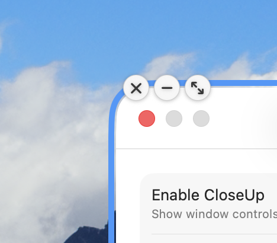
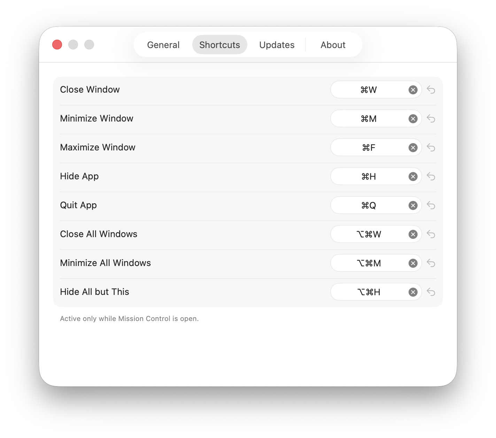

# CloseUpPlus

[English](../../README.md) · [简体中文](README.zh-CN.md) · [繁體中文](README.zh-TW.md) · **日本語** · [Français](README.fr.md) · [Deutsch](README.de.md) · [Español](README.es.md) · [Português](README.pt-BR.md) · [Русский](README.ru.md)

**コントロールを Mission Control に取り戻す。** CloseUpPlus は、ウィンドウのコントロールをネイティブの macOS Mission Control 上に重ねて表示します。概要表示から離れることなく、任意のウィンドウを閉じる、しまう、最大化、隠す、または終了でき、さらにフルキーボード操作も追加します。無料・ネイティブ・オープンソース。

## スクリーンショット

<p align="center">
  <picture>
    <source media="(prefers-color-scheme: dark)" srcset="../images/overlay-dark.png">
    
  </picture>
</p>

<p align="center">
  <picture>
    <source media="(prefers-color-scheme: dark)" srcset="../images/settings-general-en-dark.png">
    
  </picture>
  <picture>
    <source media="(prefers-color-scheme: dark)" srcset="../images/settings-shortcuts-en-dark.png">
    
  </picture>
</p>

## 機能

- **概要から閉じる** — Mission Control でウィンドウのサムネールにポインタを重ね、赤い × をクリックすれば、そのウィンドウに切り替えることなく即座に閉じられます。
- **あらゆるウィンドウ操作** — しまう、最大化、アプリを隠す、アプリを終了する。閉じる・しまう・最大化は設定でオン／オフできるオプションのボタンです。隠す・終了は、ウィンドウが対応していれば常に表示されます。
- **キーボード操作** — ポインタの下にあるウィンドウに対してネイティブの操作を実行できます。⌘W で閉じる、⌘M でしまう、⌘F で最大化、⌘H で隠す、⌘Q で終了。すべて再割り当て可能です。
- **一括操作** — ⌥⌘W ですべて閉じる、⌥⌘M ですべてしまう、⌥⌘H でポインタの下にあるもの以外をすべて隠す。
- **9 つの言語** — English、简体中文、繁體中文、日本語、Français、Deutsch、Español、Português、Русский。アプリ内で切り替え可能で、即座に反映されます。
- **ネイティブで控えめ** — Mission Control 自身のキーボード処理を決して奪わないパッシブなオーバーレイです。メニューバーのみで、Dock アイコンはありません。
- **インタラクティブ Pin** — Mission Control から選択したウィンドウを固定し、ポインタを移すと実際のウィンドウを操作できます。

## CloseUpPlus との比較

CloseUpPlus は一つのことに専念しています — **ネイティブ**の Mission Control ビュー内で直接ウィンドウを操作すること。同じことを実現する主な代替アプリと比較すると、次のとおりです（2026-07-02 時点で各プロジェクトの公式サイト／リポジトリを基に確認済み。出典はリンク先を参照してください。公式が明記していない項目は推測せず「未記載」としています）：

| | CloseUpPlus | [Mission Control Close](https://missioncontrolclose.com/) | [Open Mission Control](https://github.com/nohackjustnoobb/OpenMissionControl) | [Mission Control Plus](https://www.fadel.io/missioncontrolplus) |
|---|---|---|---|---|
| 価格 | 無料 | £5 の買い切り（7 日間の無料トライアル） | 無料 | 有料、価格非公開（10 日間トライアル） |
| ライセンス | オープンソース（GPL-3.0） | クローズドソース | オープンソース（GPL-3.0） | クローズドソース |
| ポインタ下のウィンドウへの操作 | 閉じる・しまう・最大化・隠す・終了 | 閉じるのみ | 閉じる・しまう・最大化 | 閉じる・しまう・終了（+開く） |
| 一括操作 | すべて閉じる・すべてしまう・これ以外を隠す | すべて閉じる | 未記載 | 未記載 |
| キーボードショートカットの再割り当て | すべての操作で可能 | ショートカットはあるが再割り当て可否は未記載 | 固定（⌘Q/⌘W/⌘M/⌘F） | 固定（⌘W/⌘M/⌘Q/⏎） |
| 多言語対応 | 9 言語、アプリ内で切り替え | 未記載 | 未記載 | 未記載 |
| 必要な macOS | 14.0 以降 | 26.0（Tahoe）以降 | 未記載 | 10.13 以降 |
| 対応 CPU | Apple Silicon と Intel、それぞれ個別にビルド | Apple Silicon のみ | 未記載 | 未記載 |
| 配布方法 | GitHub Releases（アドホック署名、Apple 公証なし） | 直接ダウンロード、LemonSqueezy 決済 | GitHub + Homebrew（未署名 — 隔離属性を手動で解除する必要あり） | 直接ダウンロード |

[AltTab](https://github.com/lwouis/alt-tab-macos)、[DockDoor](https://github.com/ejbills/DockDoor)、[HyperDock](https://bahoom.com/hyperdock)、[Contexts](https://contexts.co/) など、他の macOS ウィンドウ管理ツールも関連するウィンドウ操作（閉じる・隠す・切り替え）を提供していますが、いずれも独自のスイッチャーや Dock ホバー UI を通じて行うもので、ネイティブの Mission Control ビューではありません。関連はしていますが異なる問題を解決するツールのため、上表には含めていません。

## 必要環境

- macOS 14.0 以降
- Apple Silicon（arm64）または Intel（x86_64）— CloseUpPlus はアーキテクチャごとにビルドを提供しています。お使いの Mac に合ったものをダウンロードしてください
- アクセシビリティ権限（CloseUpPlus はアクセシビリティ API を通じてウィンドウを読み取り、操作します）
- Pin 使用時のみ画面収録権限が必要です。選択したウィンドウはローカルで処理され、保存やアップロードはされません

## インストール

[Releases](https://github.com/FLAMEEERT/CloseUpPlus/releases) からお使いの Mac のチップに合ったものをダウンロードしてください — Apple Silicon は `CloseUpPlus-*-arm64.dmg`、Intel は `CloseUpPlus-*-x86_64.dmg` です。開いて CloseUpPlus を「アプリケーション」フォルダにドラッグします。現在のビルドは Apple 公証を受けていないため、初回起動時はアプリを右クリックして「開く」を選ぶか、「システム設定 → プライバシーとセキュリティ」から許可してください。

初回起動時に、「システム設定」→「プライバシーとセキュリティ」→「アクセシビリティ」でアクセシビリティアクセスを許可してください。CloseUpPlus が該当のペインを開いてくれます。

## 使い方

通常どおり Mission Control を開きます（3 本指または 4 本指で上にスワイプするか、Mission Control キーを押します）。任意のウィンドウにポインタを重ねるとコントロールのまとまりが表示されます。または、キーボードを使います。

| 操作 | ショートカット | 対象 |
|---|---|---|
| ウィンドウを閉じる | ⌘W | ポインタの下にあるウィンドウ |
| ウィンドウをしまう | ⌘M | ポインタの下にあるウィンドウ |
| ウィンドウを最大化 | ⌘F | ポインタの下にあるウィンドウ |
| アプリを隠す | ⌘H | ポインタの下にあるウィンドウ |
| アプリを終了 | ⌘Q | ポインタの下にあるウィンドウ |
| すべてのウィンドウを閉じる | ⌥⌘W | すべてのウィンドウ |
| すべてのウィンドウをしまう | ⌥⌘M | すべてのウィンドウ |
| これ以外をすべて隠す | ⌥⌘H | ポインタの下にあるもの以外のすべてのアプリ |

すべてのショートカットは「設定」→「ショートカット」で再割り当てできます。CloseUpPlus のオン／オフは、いつでもメニューバーのアイコンか「設定」→「一般」から切り替えられます。

## 設定

- **一般** — 有効／無効、ログイン時に起動、メニューバーアイコンを隠す、アクセシビリティの状態とワンクリックでの許可、表示するコントロールボタン、アプリ内の言語。
- **ショートカット** — すべての操作を再割り当て。
- **情報** — バージョン、ライセンス、GitHub リポジトリへのリンク、謝辞。

## ソースからビルドする

```bash
brew install xcodegen
make build      # デバッグビルド（独立した "CloseUp Dev" 識別子）
make dev-cert   # 任意: リビルドしてもアクセシビリティの許可が失われないよう、安定したローカル署名 ID を作成
make test       # ユニットテスト + i18n ガード
make run        # ビルドして起動
make dmg        # ドラッグでインストールできる .dmg をパッケージ化
```

Xcode プロジェクトは XcodeGen によって `project.yml` から生成され、リポジトリには含まれていません。アーキテクチャについては [../DESIGN.md](../DESIGN.md) を、リリースプロセスについては [../RUNBOOK.md](../RUNBOOK.md) を参照してください。

## ライセンス

[GPL-3.0](../../LICENSE)。

## 謝辞

[OpenMissionControl](https://github.com/nohackjustnoobb/OpenMissionControl)、[DockDoor](https://github.com/ejbills/DockDoor)、[alt-tab-macos](https://github.com/lwouis/alt-tab-macos)に感謝します。CloseUpPlus による Mission Control の非公開 API の使い方は、これらのプロジェクトの API の使い方を参考にしています。
